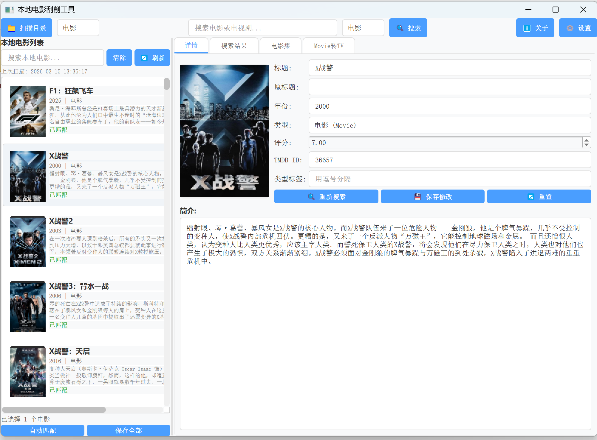
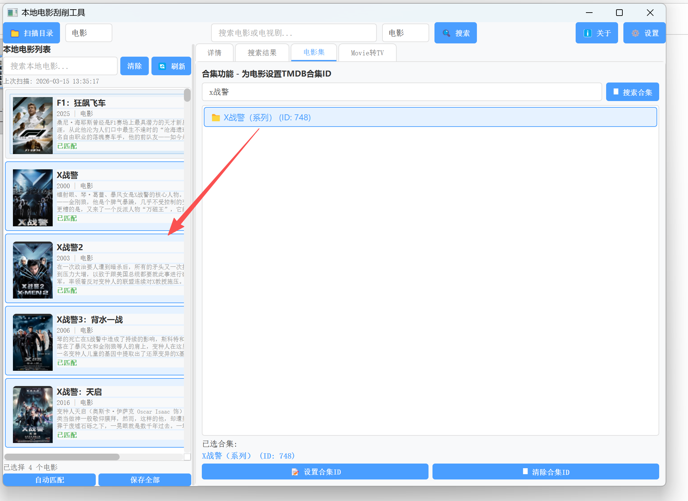
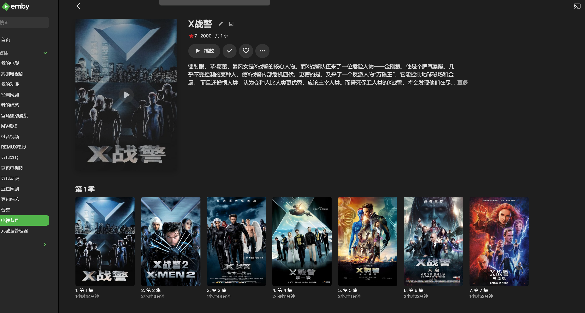

# movie-scraper

<div align="center">
   <p><strong>自动刮削电影+电视剧</strong></p>
    

  <br>
 </div>

<div align="center">
   <p><strong>手动给电影编辑系列</strong></p>
  
  <br>
 </div>

 <div align="center">
   <p><strong>movie系列可以转tv模式</strong></p>
  
  <br>
 </div>

  <div align="center">
   <p><strong>tv模式电影集展示</strong></p>
  
  <br>
 </div>

 
一个基于 PyQt5 开发的本地电影/电视剧刮削工具，支持从 TMDB 数据库获取影片信息并生成 NFO 文件和海报。

## 功能特点

- **智能扫描**：自动扫描本地电影和电视剧目录
- **TMDB 集成**：从 TMDB 数据库获取影片详细信息
- **NFO 生成**：自动生成 Kodi/Emby/Jellyfin 兼容的 NFO 文件
- **海报下载**：自动下载影片海报和背景图
- **批量处理**：支持批量匹配和导出
- **合集支持**：支持电影合集识别和管理
- **多线程处理**：扫描和搜索使用多线程，界面不卡顿

## 系统要求

- Windows 7/10/11
- Python 3.8+
- 网络连接（用于访问 TMDB API）

## 安装方法

### 方法一：使用预编译版本

1. 下载 `movie-scraper.exe`
2. 双击运行即可

### 方法二：从源码运行

1. 克隆仓库
```bash
git clone https://github.com/lxs-ol/movie-scraper.git
cd movie-scraper
```

2. 安装依赖
```bash
pip install -r requirements.txt
```

3. 运行程序
```bash
cd movie-scraper
python main.py
```

## 使用方法

### 1. 扫描本地影片

1. 点击"选择目录"按钮
2. 选择电影或电视剧所在的文件夹
3. 选择扫描类型（电影/电视剧）
4. 点击"开始扫描"

### 2. 搜索匹配

1. 在搜索框中输入影片名称
2. 选择搜索类型（电影/电视剧/合集/综合）
3. 点击"搜索"按钮
4. 从搜索结果中选择正确的影片

### 3. 生成 NFO 文件

1. 选中已匹配的影片
2. 点击"生成 NFO"按钮
3. 程序会自动在影片所在目录生成 `.nfo` 文件和海报图片

### 4. 批量导出

1. 选中多个影片（支持 Ctrl/Shift 多选）
2. 点击"批量导出 NFO"按钮
3. 所有选中的影片将自动生成 NFO 文件

## 支持的影片格式

- 视频文件：`.mp4`, `.mkv`, `.avi`, `.mov`, `.wmv`, `.flv`, `.webm`, `.m4v`, `.ts`, `.strm`
- NFO 文件：`.nfo`
- 海报文件：`.jpg`, `.png`

## 文件命名规范

程序支持自动识别以下命名格式的影片：

- `电影名 (年份).mp4` - 例如：`肖申克的救赎 (1994).mp4`
- `电影名.年份.mp4` - 例如：`肖申克的救赎.1994.mp4`
- 电视剧季文件夹：`Season 01` 或 `第一季`

## 配置说明

首次运行时会自动创建 `config.json` 配置文件，包含以下设置：

```json
{
  "tmdb_api_key": "your_api_key_here",
  "language": "zh-CN",
  "poster_size": "w500",
  "backdrop_size": "original"
}
```

### 获取 TMDB API Key

1. 访问 [TMDB 官网](https://www.themoviedb.org/)
2. 注册并登录账号
3. 进入账户设置 -> API
4. 申请 API 密钥
5. 将密钥填入 `config.json` 文件

## 项目结构

```
movie-scraper/
├── main.py              # 程序入口
├── gui.py               # 图形界面
├── scanner.py           # 本地影片扫描器
├── api.py               # TMDB API 接口
├── requirements.txt     # Python 依赖
├── config.json          # 配置文件（运行时生成）
└── build_single_exe/    # 打包输出目录
```

## 打包成可执行文件

```bash
cd movie-scraper
python setup.py build
```

打包后的文件将位于 `build_single_exe/` 目录。

## 注意事项

1. 首次使用需要配置 TMDB API Key
2. 确保网络连接正常以访问 TMDB 数据库
3. 建议在操作前备份重要的 NFO 文件
4. 部分影片可能需要手动匹配

## 技术栈

- **GUI 框架**：PyQt5
- **API 请求**：requests
- **打包工具**：cx-Freeze
- **数据来源**：The Movie Database (TMDB)

## 许可证

MIT License

## 作者

lxs-ol

## 更新日志

### v1.0.0
- 初始版本发布
- 支持电影和电视剧刮削
- 支持 NFO 文件生成
- 支持海报下载
